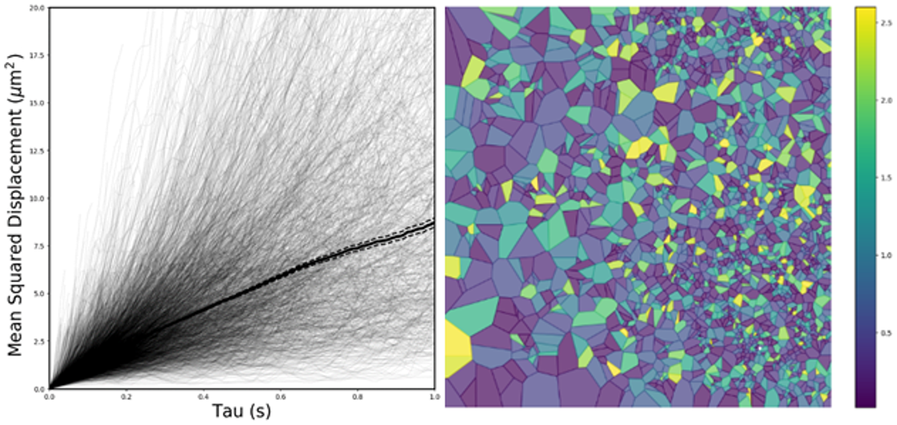

## diff_classifier

diff_classifier is a python package for analyzing and visualizing 2D
nanoparticle trajectory data from multi-particle tracking analysis.  The package
utilizes the ImageJ package Trackmate for tracking analysis, and Cloudknot for
parallelization on AWS.

This is the diff_classifier development site.  You can view the source code and
file new issues. If you are just getting started, you should look at the
[diff_classifier documentation](https://ccurtis7.github.io/diff_classifier/)

## Contributing

Contributions are welcome! Diff_classifier is open source, built on open source,
and we love any input, suggestions, and problems.

[Guidelines](CONTRIBUTING.md) for contributing are included for your convenience.

## Credits

This package was created with [shablona](https://github.com/uwescience/shablona).

Guidelines for contributions were based off the 
[CONTRIBUTIONS](https://github.com/richford/cloudknot/blob/master/CONTRIBUTING.md)
file developed by [Adam Richie-Halford](https://github.com/richford).
