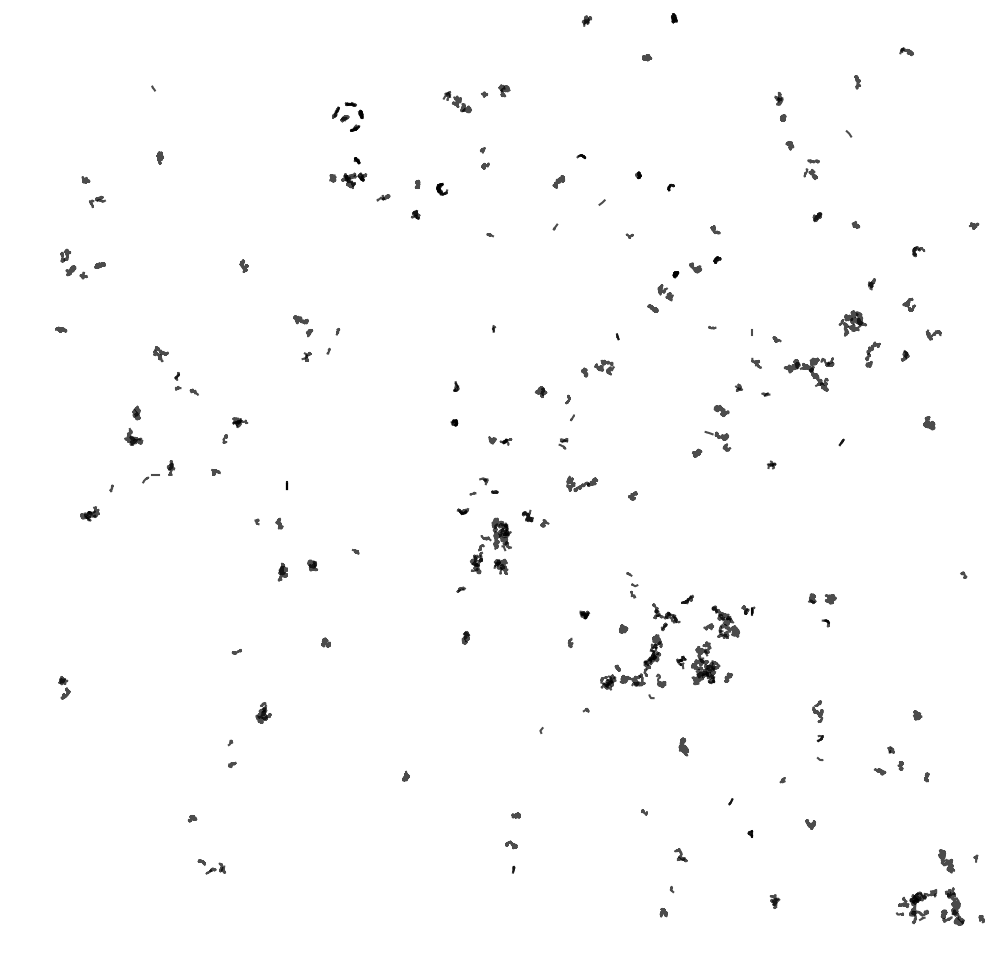
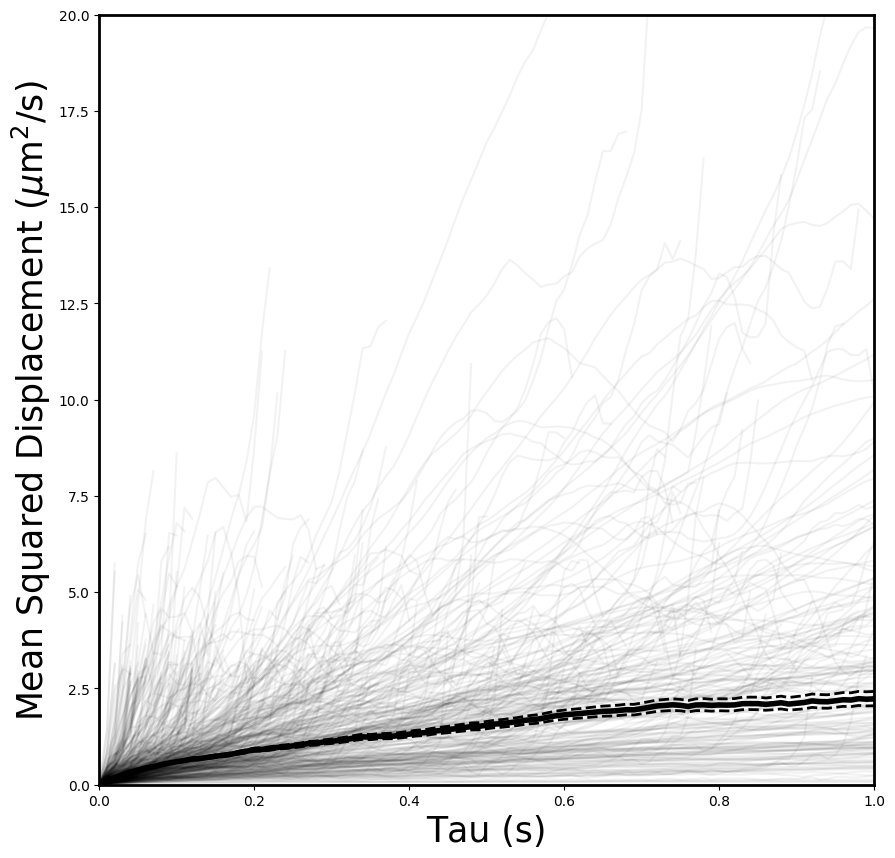
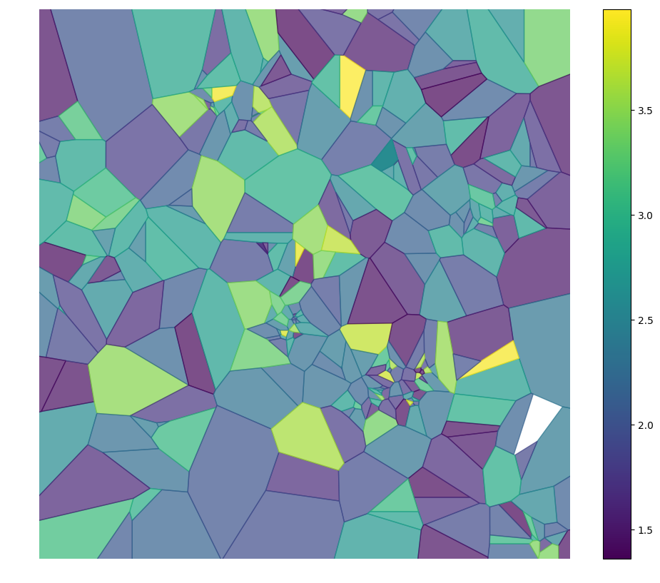
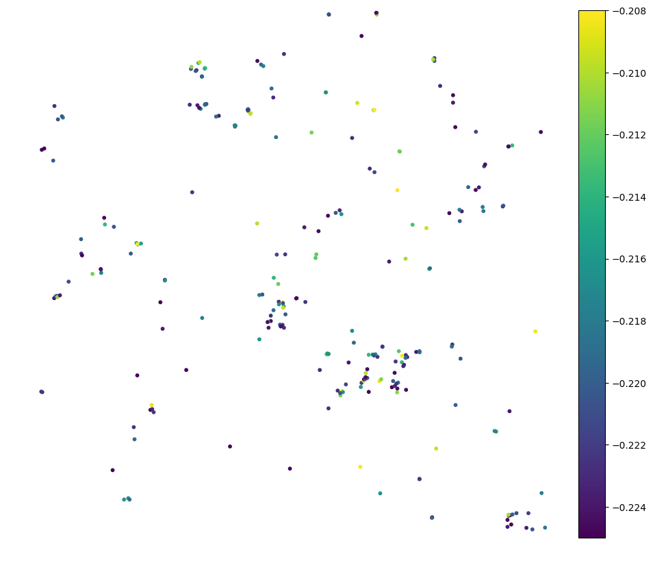
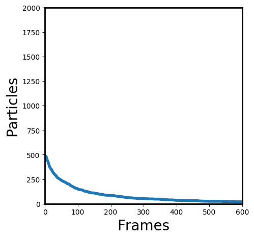
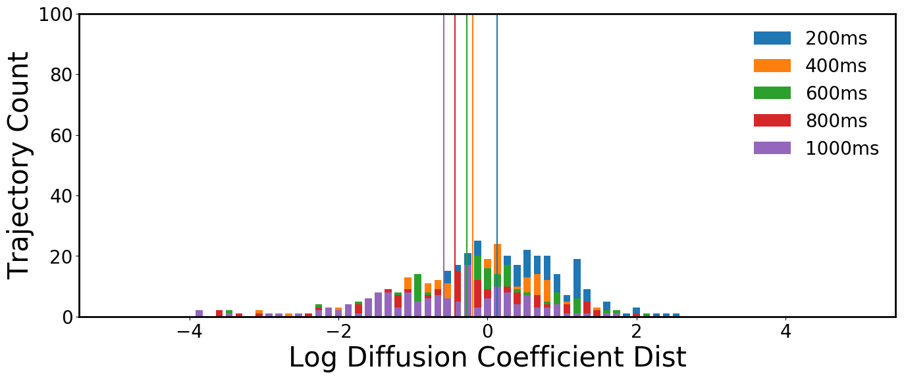

.. _features-analysis-label:

Calculating features
====================

The features package in diff_classifier calculates geometric features from the
xy data of each trajectory and assembles them into a pandas dataframe.  The
current features that are calculated include:

* alpha: anomalous diffusion exponent.
* asymmetry (1, 2, 3): various expressions of the manitude of asymmetry of a
  trajectory.
* aspect ratio: the ratio of the long and short side of the minimum bounding
  rectangle.
* elongation: a transform of the aspect ratio, one minus the inverse of the
  aspect ratio.
* boundedness: quantifies how much a particle with diffusion coefficient D is
  restricted by a circular confinement of radius r when it diffuses for time t.
* trappedness: expresses the boundedness in terms of a probability.
* efficiency: relates the squared net displacement to the sum of squared step
  lengths.
* straightness: similar to the efficiency, relates the net displacement to the
  sum of step lengths.
* fractal dimension: 1 for directed trajectories, 2-3 for confined or subdiffusion.
* Gaussianity: 0 for normal diffusion, deviates from 0 for other types.
  kurtosis:
* mean squared displacement ratio: 0 for Brownian motion, <0 for restricted motion,
  >0 for directed motion.

.. code-block:: python

  calculate_features(df, framerate=1)

Visualization
-------------

Diff_classifier includes a module of standard image outputs from MSD and features
calculations.  These include:

  Trajectory plot of tracked particles in target video.

  Mean squared displacements of trajectories in target video.

  Heatmaps of trajectory features associated with trajectories in target video.

  Scatterplots of trajectories also colored according to calculated features.

  Number of detected particles per frame.

  Histogram of mean squared displacements and diffusion coefficients of
  trajectories in target video.
